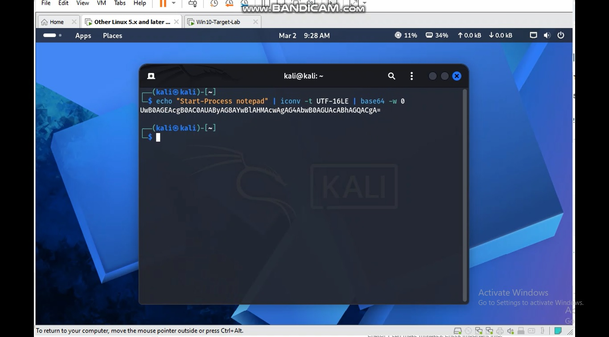
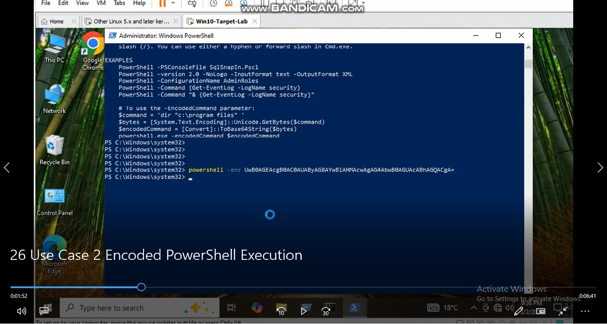
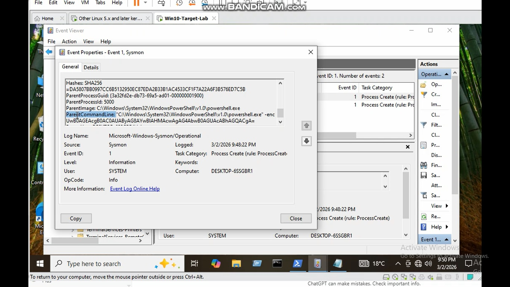
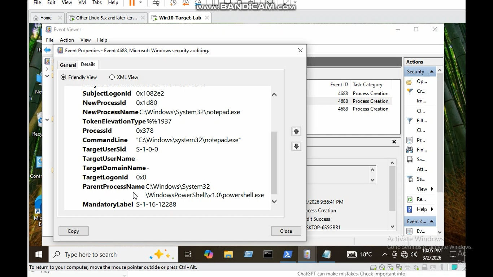

# Case 2 – Encoded PowerShell Execution Detection

## Attack Description

Attackers often use Base64 encoded PowerShell commands to hide malicious activity and bypass security monitoring.

Encoded commands make it harder for analysts to quickly understand the executed script.

## Lab Environment

- Windows 10 Target Machine
- Kali Linux Attacker Machine
- Sysmon Installed
- Windows Security Event Logs

## Attack Simulation

The attacker executes an encoded PowerShell command:

powershell -NoProfile -WindowStyle Hidden -EncodedCommand

The command is Base64 encoded to hide the real payload.

## Detection Method

Detection is performed using Windows Security Event Logs.

Relevant Event ID: 4688 – Process Creation


Indicators:

- PowerShell execution
- EncodedCommand parameter
- Hidden window style
- NoProfile execution

## Detection Logic

Security analysts should monitor suspicious PowerShell command lines containing:

- EncodedCommand
- Hidden
- NoProfile

## MITRE ATT&CK

Technique: T1059.001 – PowerShell

## Detection Rule

Example Sigma rule:

```yaml
title: Suspicious Encoded PowerShell Command
logsource:
  product: windows
  service: security
detection:
  selection:
    EventID: 4688
    CommandLine|contains:
      - EncodedCommand
      - powershell

condition: selection
```


## Lab Evidence

### 1. Generating Encoded PowerShell Command (Attacker Machine - Kali)



The attacker generates a Base64 encoded PowerShell command using Kali Linux.

---

### 2. Executing Encoded PowerShell on Target Machine



The encoded PowerShell command is executed on the Windows target machine.

---

### 3. Sysmon Event Detection



Sysmon logs the PowerShell process execution including the encoded command.

---

### 4. Windows Security Event 4688



Windows Security Event ID 4688 records the process creation of PowerShell with encoded command.


