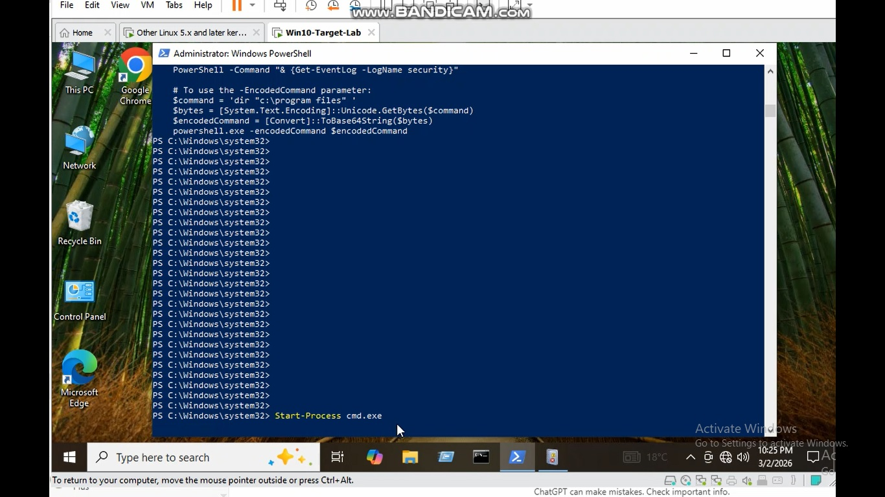
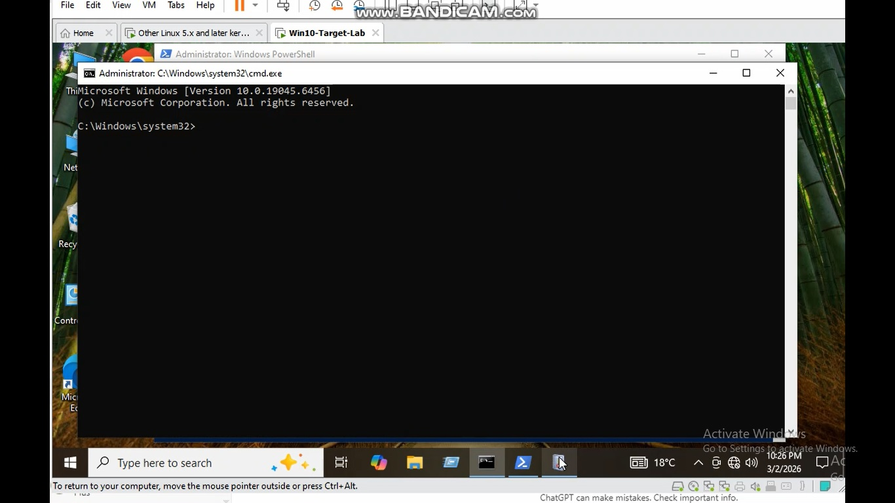
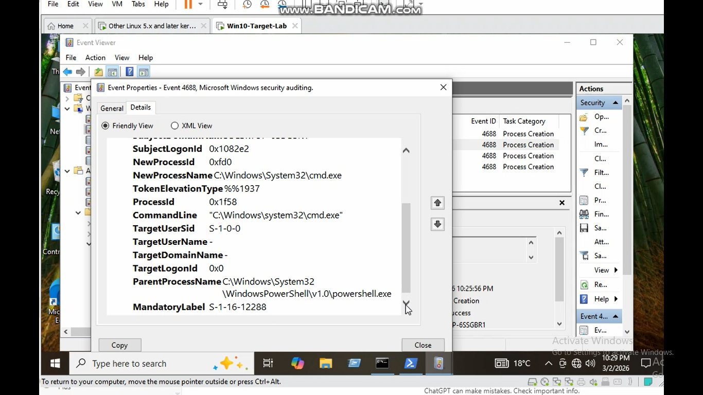

# Use Case 3 – Suspicious Parent-Child Process

## Objective

Detect suspicious parent-child process relationships where PowerShell launches another process.

Attackers frequently abuse PowerShell to spawn additional processes such as cmd.exe during post-exploitation.

This lab simulates this behavior and shows how it appears in Windows Security logs.

---

## Attack Simulation

The following PowerShell command was executed:
Start-Process cmd.exe


This created the following process chain:
powershell.exe → cmd.exe


Such behavior can indicate suspicious activity if PowerShell spawns command shells.

---

## MITRE ATT&CK Mapping

Technique:

T1059 – Command and Scripting Interpreter

Sub-technique:

T1059.001 – PowerShell

---

## Detection Rule

Example Sigma rule:

```yaml
title: Suspicious PowerShell Spawning CMD
logsource:
  product: windows
  service: security

detection:
  selection:
    EventID: 4688
    ParentProcessName|contains:
      - powershell.exe
    NewProcessName|contains:
      - cmd.exe

condition: selection
```

ab Evidence
1. PowerShell launching cmd.exe
 

   
2. Command Prompt opened
 


3. Windows Security Event 4688 showing process creation
   


   
