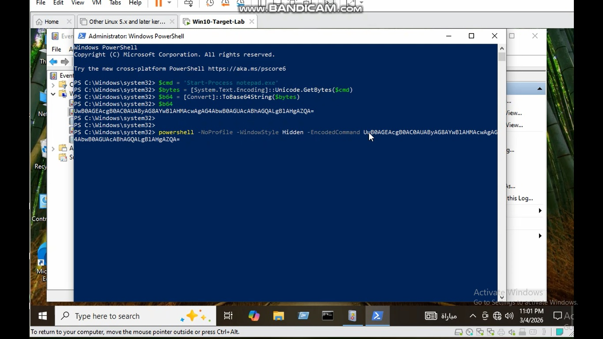
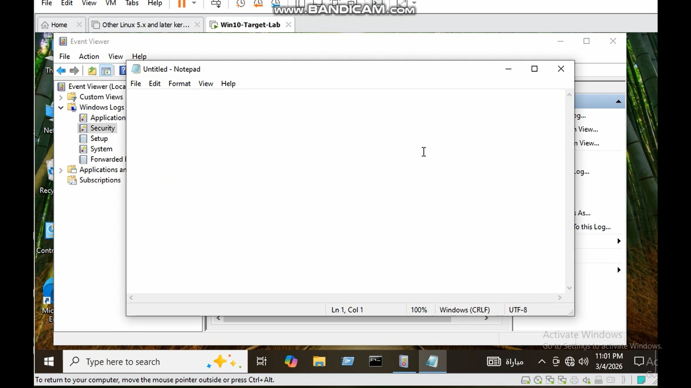
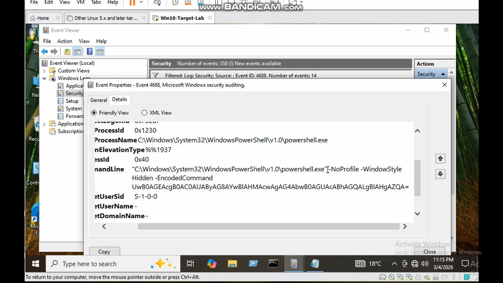

# Use Case 5 – Encoded Hidden PowerShell Execution

## Objective

Detect suspicious PowerShell execution using encoded commands and hidden window style.

Attackers frequently use encoded commands to obfuscate malicious scripts and bypass security controls.

---

## Attack Simulation

The following PowerShell command was executed:
powershell -NoProfile -WindowStyle Hidden -EncodedCommand <Base64>

This command hides the PowerShell window and executes a Base64 encoded payload.

---

## MITRE ATT&CK Mapping

Technique: T1059.001 – PowerShell

---

## Detection Logic

Monitor **Windows Event ID 4688** for suspicious PowerShell command line parameters such as:

- EncodedCommand
- NoProfile
- WindowStyle Hidden

---

## Detection Rule

See Sigma rule in:sigma-rule.yml

---

## Lab Evidence

### Encoded PowerShell Execution

---

### Notepad executed by payload

---

### Event ID 4688 showing encoded command

