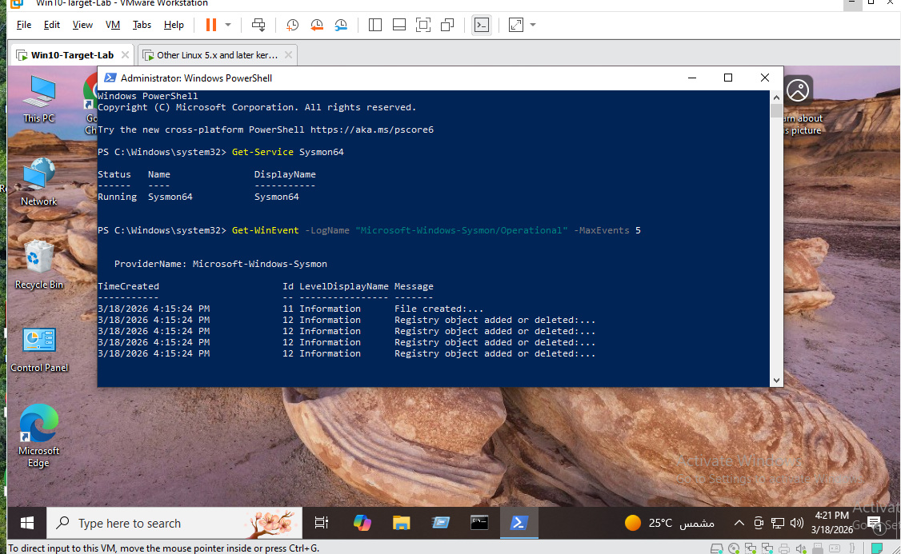
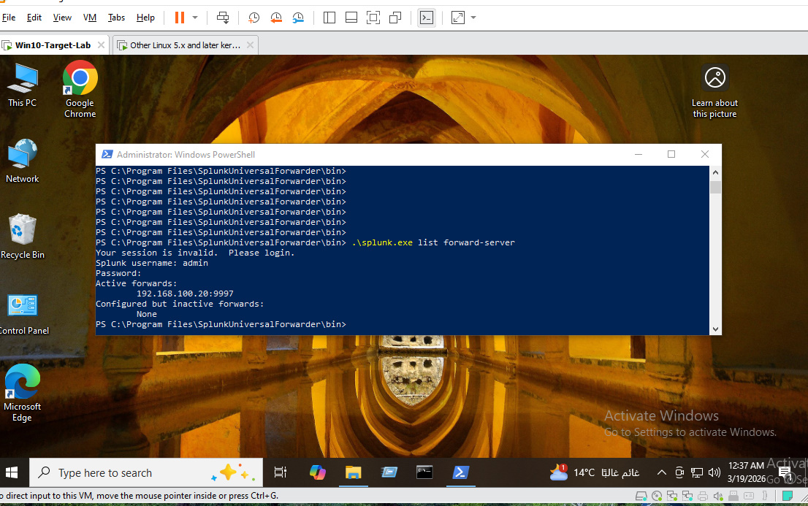
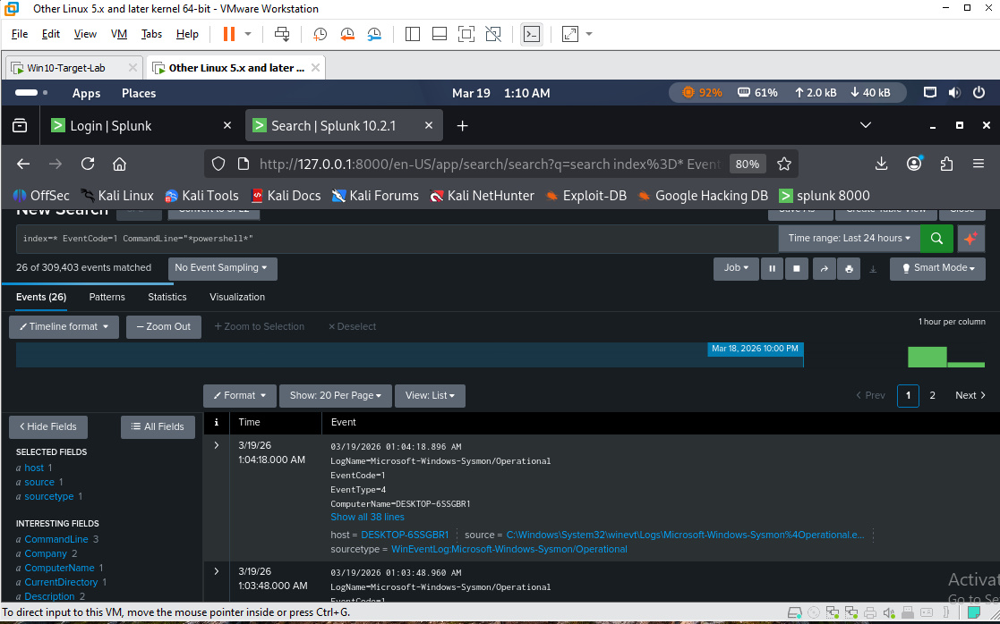
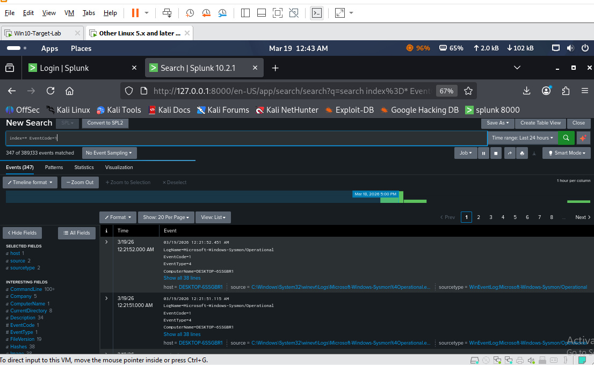
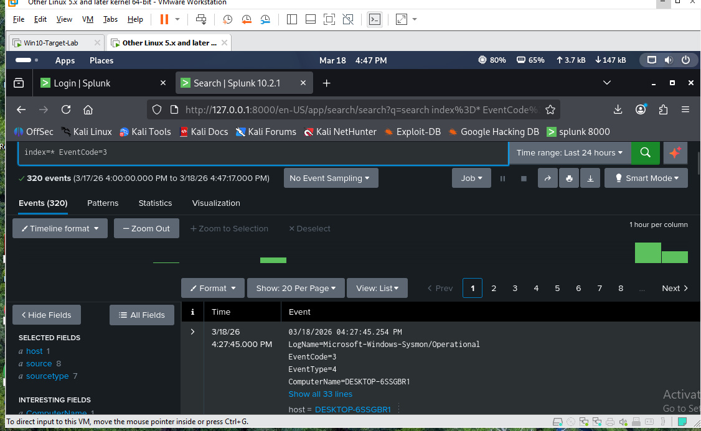
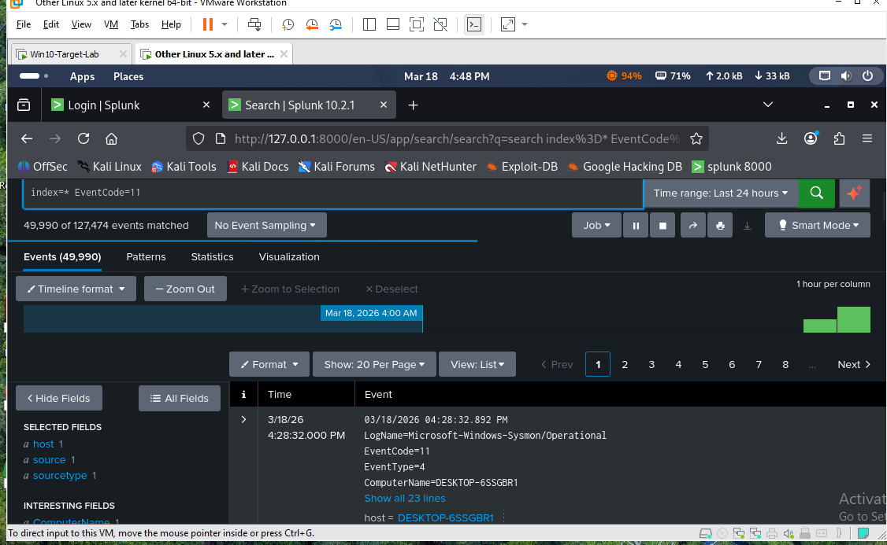
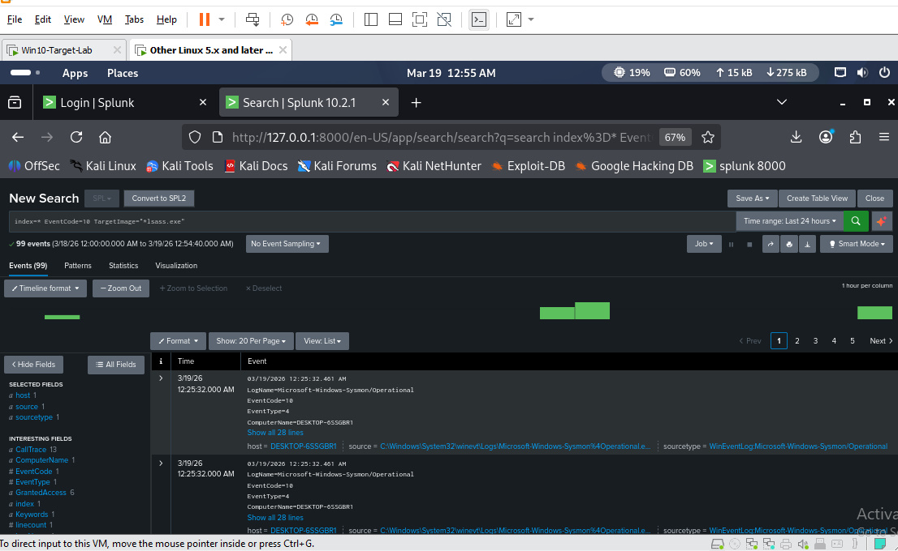

# Case 9 – LSASS Access Detection (Real-Time SOC Lab)

## Overview

This use case focuses on detecting suspicious access to lsass.exe, a critical Windows process responsible for authentication and credential storage.

In modern cyber attacks, adversaries attempt to access LSASS memory to extract credentials using techniques such as credential dumping.

This lab is built using a real-time SOC architecture, where logs are collected live from a Windows endpoint using Sysmon and forwarded to Splunk SIEM.

---

## Objective

Detect unauthorized or suspicious process access to:

lsass.exe

## Such activity may indicate:

- Credential Dumping
- Privilege Escalation
- Post-Exploitation Activity

---

## SOC Architecture

This project uses a real-world SOC pipeline:

Windows Endpoint (Sysmon)
        ↓
Splunk Universal Forwarder
        ↓
Splunk SIEM (Port 9997)
        ↓
Detection Rules + Alerts + Dashboards

---

## Data Flow

1. Sysmon collects system activity (Process, Network, File, Access)
2. Logs are sent via Splunk Universal Forwarder
3. Splunk ingests logs in real-time
4. Detection rules analyze events
5. Alerts and dashboards visualize suspicious activity

---

## Why Live SOC Lab?

Unlike static sample logs, this lab is based on real-time telemetry, providing:

- Continuous log ingestion
- Real attack visibility
- Practical SOC analyst workflow
- Detection validation in real environments

---

## Log Source

Sysmon
Event ID: 10
Process Access

---

## Attack Simulation

This lab supports real-time simulation of suspicious behavior such as:

Unknown process → lsass.exe

or PowerShell-based activity that may lead to credential access attempts.

---

## Key Detection Indicators

- Access to "lsass.exe"
- Suspicious or unknown process
- High privilege access rights:
  - "0x1fffff"
  - "0x1010"
  - "0x1410"
- Non-standard parent process

---

## MITRE ATT&CK Mapping

- T1003 – Credential Dumping
- T1003.001 – LSASS Memory

---

## Detection Logic

Detection is based on identifying:

- Target process = "lsass.exe"
- EventCode = 10 (Process Access)
- Suspicious access masks
- Non-system processes interacting with LSASS

---

## Splunk Detection Queries

LSASS Access Detection

index=* EventCode=10 TargetImage="*lsass.exe"

---

## Suspicious Process + LSASS

index=* EventCode=10 TargetImage="*lsass.exe"
| stats count by SourceImage, TargetImage, GrantedAccess

---

## PowerShell Suspicious Activity

index=* EventCode=1 (CommandLine="*powershell*" OR CommandLine="*IEX*" OR CommandLine="*DownloadString*")

---

## Process Creation Monitoring

index=* EventCode=1

---

## Network Activity Monitoring

index=* EventCode=3

---

## File Creation Monitoring

index=* EventCode=11

---

## Sigma Rule

title: Suspicious LSASS Access
id: lsass-access-detection
status: experimental
description: Detects suspicious access to LSASS process
logsource:
  product: windows
  service: sysmon
detection:
  selection:
    EventID: 10
    TargetImage|endswith: 'lsass.exe'
  condition: selection
level: high
tags:
  - attack.credential_access
  - attack.t1003
  - attack.t1003.001

---

## Alerting

Alerts are triggered in Splunk when:

- LSASS access is detected
- Suspicious command-line activity appears
- Abnormal process behavior is observed

## Example alert:

[ALERT] Suspicious LSASS access detected!

---

## SOC Dashboard

The dashboard provides visibility into:

- Process Activity (EventCode=1)
- Network Connections (EventCode=3)
- File Creations (EventCode=11)
- Suspicious Commands (PowerShell)
- LSASS Access Events

---

## Screenshots

This lab includes real screenshots from:

- Sysmon logs (Windows)
- Splunk search results
- Detection queries
- SOC dashboard

Located in:

screenshots/

---

## Analyst Investigation Steps

1. Identify source process accessing LSASS
2. Verify process path and legitimacy
3. Analyze parent process chain
4. Check command-line arguments
5. Investigate lateral movement or persistence
6. Correlate with other events (network/file activity)

---

## False Positives

- Antivirus software
- EDR solutions
- Legitimate security tools

---

Severity

High

---

## Screenshots

### Sysmon Service and Recent Logs


### Splunk Universal Forwarder Running


### PowerShell Attack Code Test


### PowerShell Detection in Splunk


### Process Creation Events (EventCode=1)


### Network Connection Events (EventCode=3)


### File Creation Events (EventCode=11)


### LSASS Access Detection (EventCode=10)


----

## Conclusion

Access to LSASS is highly sensitive and often linked to credential theft.

This real-time detection lab enables SOC analysts to monitor, detect, and investigate credential access attempts using live telemetry and professional SIEM workflows.

---

## Skills Demonstrated

- Real-Time SOC Monitoring
- Sysmon Log Analysis
- Splunk SIEM Usage
- Detection Engineering
- Sigma Rule Development
- Threat Hunting
- Incident Investigation

---

## Elastic Validation Lab

In addition to Splunk validation, this use case was also implemented and tested using the Elastic Stack.

### Lab Environment

- Kali Linux (Elasticsearch + Kibana)
- Windows 10 Target Machine
- Sysmon (Event Logging)
- Winlogbeat (Log Forwarding)

---

### Objective

Detect suspicious access to the LSASS process using Elastic SIEM.

---

### Data Flow

Windows (Sysmon) → Winlogbeat → Elasticsearch → Kibana

---

### Detection Query (KQL)

```
kql
event.code:10 AND winlog.event_data.TargetImage:"*lsass.exe"

`````

### Detection Result 
The query successfully detected LSASS access activity.
Key indicators observed:
 - Event ID: 10 (ProcessAccess)
 - TargetImage:       C:\Windows\System32\lsass.exe
 - Source User: NT AUTHORITY\SYSTEM
 - Granted Access: 0x2000
   
This confirms visibility into sensitive credential access behavior.

## Elastic Lab Screenshots:
1. Elastic Installation
�
2. Elasticsearch Running
�
3. Kibana Login
�
4. Kibana Home Dashboard
�
5. LSASS Process Verification (Windows)
�
6. Winlogbeat Index Pattern
�
7. Logs in Kibana
�
8. LSASS Detection Query
�
9. Detection Result (JSON Evidence)
�

### Analyst Notes
- LSASS access events were successfully captured using Sysmon Event ID 10.
- Detection was validated in Kibana using real log ingestion.
- Some fields like SourceImage may not always appear depending on event structure.
- GrantedAccess value helps determine the level of access to LSASS.

### Conclusion
Elastic Stack successfully detected LSASS access activity, providing visibility into potential credential access techniques.
This lab demonstrates real SOC capabilities using:
 - Log ingestion
 - Detection queries
 - Event investigation
 - Multi-platform validation (Splunk     +Elastic)

